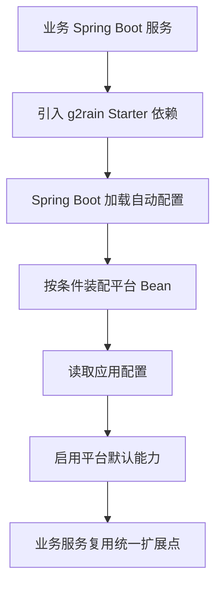



  

# g2rain-spring-boot-starter

下一代AI软件开发范式，AI原生Agent平台，开源的企业级SaaS底座。

g2rain 后端 Starter 集成组件，面向 Spring Boot 应用提供自动配置、默认约定与可复用扩展点；作为平台后端研发支撑层被多个 g2rain 服务复用

[官网](https://www.g2rain.com) · [Issues](https://github.com/g2rain/g2rain/issues) · [Discussions](https://github.com/g2rain/g2rain/discussions)

## 目录

- 项目简介
- 平台定位
- 业务域说明
- 功能概览
- 使用场景
- 核心流程
- 流程图
- 技术栈
- 环境要求
- 快速开始
- 构建与镜像
- 代码质量与测试
- 接入示例
- 安全说明
- 与关联仓库的关系
- 模块说明
- 职责边界
- 常见问题
- 关联仓库
- 参与贡献
- 许可证
- 联系我们
- 致谢

## 项目简介

g2rain 后端 Starter 集成组件，面向 Spring Boot 应用提供自动配置、默认约定与可复用扩展点；作为平台后端研发支撑层被多个 g2rain 服务复用

## 平台定位

该仓库位于 g2rain 后端研发支撑层，为多个后端项目提供集成能力、工程化工具或共享扩展。

## 业务域说明

该仓库聚焦于 `Spring Boot 自动配置、后端集成规范与平台能力快速接入`。

核心对象包括：
- 权限
- 主体

## 功能概览

| 能力 | 说明 |
| --- | --- |
| 自动配置接入 | 通过 Spring Boot 自动配置机制为业务服务注入平台默认配置、Bean 与扩展能力。 |
| 约定优先 | 将平台后端通用接入方式沉淀为 Starter，减少业务服务重复配置。 |

## 使用场景

| 场景 | 说明 |
| --- | --- |
| 业务服务快速接入平台能力 | 当 Spring Boot 服务需要复用 g2rain 默认配置、公共 Bean 或平台扩展点时，引入 Starter 即可完成标准化接入。 |
| 统一后端工程约定 | 当多个服务需要保持一致的安全、Web、配置、观测或基础设施接入方式时，通过 Starter 固化默认约定。 |

## 核心流程

| 流程 | 关键步骤 | 代码线索 |
| --- | --- | --- |
| Starter 接入流程 | 业务服务引入 Maven 依赖 → Spring Boot 扫描自动配置 → 按条件装配平台 Bean → 业务服务通过默认配置或自定义属性启用能力 | pom.xml、AutoConfiguration、spring.factories 或 AutoConfiguration.imports |

## 流程图

## 技术栈

| 类别 | 说明 |
| --- | --- |
| 运行时 | Java 25、Spring Boot 4.0.5、Spring Cloud 2025.1.1 |
| 安全与令牌 | g2rain-starter-aegis-core |
| 基础设施 | Redis、OpenFeign |
| 其他 | SpringDoc OpenAPI、Lombok |

## 环境要求

- JDK 25+
- Maven 3.9+

## 快速开始

| 步骤 | 命令或位置 | 说明 |
| --- | --- | --- |
| 准备构建环境 | JDK 25+、Maven 3.9+ | 工具组件通常只需要 Java 与 Maven 构建环境。 |
| 构建组件 | `mvn clean package` | 执行 Maven 构建，生成可发布或可本地安装的组件产物。 |
| 本地安装 | `mvn clean install` | 安装到本地 Maven 仓库，便于业务工程试用依赖。 |

版本号以项目构建配置为准，当前识别为 `1.0.3`。

## 构建与镜像

| 目标 | 命令 | 产物 | 说明 |
| --- | --- | --- | --- |
| 组件产物 | `mvn clean package` | `g2rain-spring-boot-starter-1.0.3.jar` | 执行 Maven 标准构建，生成可发布的 Starter 组件产物。 |
| 本地 Maven 安装 | `mvn clean install` | `本地 Maven 仓库产物` | 安装到本地 Maven 仓库，便于业务工程本地验证依赖。 |

## 代码质量与测试

| 检查项 | 命令 | 说明 |
| --- | --- | --- |
| Maven Enforcer | `mvn validate` | 约束 JDK 版本、Maven 版本与依赖规则。 |
| Checkstyle | `mvn checkstyle:check` | 检查 Java 代码风格与组织规范。 |
| PMD | `mvn pmd:check` | 执行静态规则检查，识别潜在代码问题。 |
| SpotBugs | `mvn spotbugs:check` | 识别潜在缺陷和风险代码。 |
| JaCoCo | `mvn test jacoco:report` | 运行测试并生成覆盖率报告。 |

## 接入示例

| 示例 | 方式 | 内容 | 说明 |
| --- | --- | --- | --- |
| Maven 依赖引入 | Maven | `<dependency><groupId>com.g2rain</groupId><artifactId>g2rain-spring-boot-starter</artifactId><version>1.0.3</version></dependency>` | 在业务工程 pom.xml 中引入该组件。 |
| 启用自动配置 | Spring Boot | `引入依赖后随应用启动自动装配` | Starter 通过 Spring Boot 自动配置机制生效，业务服务按需覆盖配置项。 |

## 安全说明

| 主题 | 说明 |
| --- | --- |
| 依赖可信边界 | 作为平台共享组件或构建工具，应通过组织 Maven 仓库、版本锁定和发布流程控制依赖来源。 |
| 自动配置影响面 | Starter 可能自动注入 Bean 或默认配置，业务服务接入前应确认启用条件与覆盖配置。 |

## 与关联仓库的关系

本仓库位于 g2rain 后端研发支撑层，通过 Maven 依赖和 Spring Boot 自动配置被平台后端服务复用。

## 模块说明

| 模块 | 职责说明 | 代码线索 |
| --- | --- | --- |
| 自动配置模块 | 提供 Spring Boot 自动配置、条件装配与默认 Bean 注册。 | AutoConfiguration、AutoConfiguration.imports、spring.factories |
| 配置属性模块 | 定义业务服务可覆盖的平台配置项和默认行为。 | Properties、ConfigurationProperties |

## 职责边界

该仓库主要负责：
- 负责提供 Spring Boot 自动配置、默认 Bean 装配和平台后端接入约定
- 负责将可复用平台能力封装为业务服务可引入的 Starter

该仓库默认不负责：
- 不直接承载业务服务的运行时业务逻辑
- 不负责具体业务数据的持久化和生命周期管理

## 常见问题

| 问题 | 可能原因 | 处理建议 |
| --- | --- | --- |
| 业务工程无法解析依赖 | 组件未发布到当前 Maven 仓库，或 groupId/artifactId/version 配置不一致。 | 检查 Maven 仓库地址、版本号和业务工程 dependencyManagement 配置。 |
| Starter 引入后能力未生效 | 自动配置条件不满足、配置项缺失或 Spring Boot 自动配置元数据未被加载。 | 检查 AutoConfiguration.imports/spring.factories、条件注解和业务工程配置。 |

## 关联仓库

| 仓库 | 协作关系 |
| --- | --- |
| g2rain-common | 复用平台公共规范、通用模型、工具能力或基础依赖约束。 |

## 参与贡献

我们欢迎所有形式的贡献：Issue 反馈、文档改进、功能建议与代码提交。

推荐流程：

1. Fork 本仓库。
2. 创建特性分支：`git checkout -b feature/your-feature-name`。
3. 提交更改：`git commit -m "Add some feature"`。
4. 推送分支：`git push origin feature/your-feature-name`。
5. 提交 Pull Request。

代码贡献前请尽量补充必要的测试和文档，并确保构建、测试与静态检查通过。

## 许可证

本项目基于 [Apache 2.0许可证](https://github.com/g2rain/g2rain-common/blob/main/LICENSE) 开源。

## 联系我们

- Issues: [GitHub Issues](https://github.com/g2rain/g2rain/issues)
- 讨论: [GitHub Discussions](https://github.com/g2rain/g2rain/discussions)
- 邮箱: g2rain_developer@163.com

## 致谢

感谢所有为 g2rain 项目提交 Issue、代码、文档、建议和使用反馈的开发者们！
