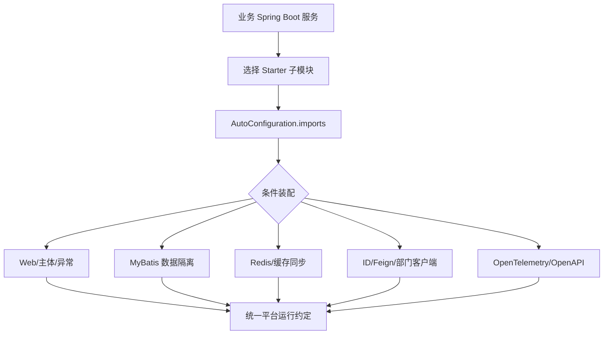

  

# g2rain-spring-boot-starter

下一代AI软件开发范式，AI原生Agent平台，开源的企业级SaaS底座。

g2rain Spring Boot 平台 Starter 集合，由 11 个可独立引入的 Maven 子模块组成，覆盖 Web 基础设施、数据权限隔离、Redis、缓存同步、分布式 ID、Feign、OpenTelemetry、Redis Stream、OpenAPI 与部门主体增强。项目通过 `AutoConfiguration.imports`、条件装配和可覆盖 Bean，将平台约定按需接入业务服务。

[工程文档](docs/index.md) · [官网](https://www.g2rain.com) · [Issues](https://github.com/g2rain/g2rain/issues) · [Discussions](https://github.com/g2rain/g2rain/discussions)

## 目录

- 项目简介
- 平台定位
- 业务域说明
- 功能概览
- 使用场景
- 核心流程
- 流程图
- 技术栈
- 环境要求
- 快速开始
- 配置说明
- 构建与发布
- 代码质量与测试
- 接入示例
- 安全说明
- 与关联仓库的关系
- 模块说明
- 职责边界
- 常见问题
- 关联仓库
- 参与贡献
- 许可证
- 联系我们
- 致谢

## 项目简介

g2rain Spring Boot 平台 Starter 集合，由 11 个可独立引入的 Maven 子模块组成。它统一 Java、Spring Boot、Spring Cloud、G2rain 公共组件及构建插件版本，并把平台基础设施封装为可独立选择的自动配置模块。

## 平台定位

该仓库是 g2rain 后端运行时集成层：位于 g2rain-common 公共契约之上、具体平台服务与业务服务之下，通过 11 个独立 Starter 把 Web、数据访问、Redis、消息、内部客户端、追踪和文档能力按需装配进 Spring Boot 应用。

## 业务域说明

该仓库聚焦于 `Spring Boot 自动配置、后端集成规范与平台能力快速接入`。

核心对象包括：
- 分布式 ID
- 缓存同步事件
- 配置属性
- 请求主体上下文
- 权限
- 数据权限策略
- 主体
- 自动配置
- Feign 客户端
- OpenAPI 文档
- OpenTelemetry 链路
- Redis 缓存与分布式锁
- Redis Stream Binder

主要流程包括：
- Spring Boot 启动时发现 AutoConfiguration.imports 并按条件装配模块的流程
- HTTP 请求包装、主体上下文建立、登录守卫、业务处理与统一异常输出流程
- MyBatis SQL 解析、数据权限策略加载、组织范围计算与隔离条件注入流程
- 领域变更事件发布到消息通道并由订阅端刷新本地缓存的流程
- 业务服务通过 ID 客户端、Feign、Redis、追踪和文档 Starter 接入平台基础设施的流程

## 功能概览

| 能力 | 说明 |
| --- | --- |
| Web 基础设施 | 自动装配请求/响应包装、主体上下文作用域、统一异常、访问日志、登录守卫、身份参数注入与 G2rain JSON Converter。 |
| 数据权限隔离 | 解析 MyBatis SQL，根据组织范围和数据权限策略为查询、写入与约束检查注入隔离条件，并支持缓存和 REST/OpenFeign 客户端。 |
| Redis 数据访问 | 提供 StringRedisHelper、GenericRedisHelper 与基于 Redisson 的 DistributedLock，并允许业务侧覆盖默认 Bean。 |
| 缓存同步 | 通过 Spring Cloud Stream 的 EventPublisher/EventSubscriber 适配实现跨节点缓存变更广播与初始化。 |
| 分布式 ID 客户端 | 装配 IdGeneratorClient 和 IdGeneratorImpl，通过 g2rain.id.generator 配置接入平台发号服务。 |
| Feign 增强 | 集中装配 g2rain 平台的 OpenFeign 客户端增强能力和调用约定。 |
| OpenTelemetry 追踪 | 通过自动配置与 EnvironmentPostProcessor 注入追踪相关默认属性并接入 OpenTelemetry。 |
| Redis Stream Binder | 实现 Spring Cloud Stream Binder，将 Redis Stream 作为消息传输通道并暴露 binder 配置属性。 |
| OpenAPI 文档 | 根据应用名、API 版本和描述自动创建 OpenAPI 元数据。 |
| 部门主体增强 | 按需通过 REST 或 OpenFeign 查询部门信息，并使用 PrincipalEnricher 补充当前主体上下文。 |
| Aegis 核心聚合 | `g2rain-starter-aegis-core` 是 POM 聚合模块，组合 Web 基础设施、身份客户端和 OpenTelemetry 追踪，作为服务核心基础能力的一站式依赖入口。 |

## 使用场景

| 场景 | 说明 |
| --- | --- |
| 新建平台后端服务 | 按需引入 Web、Redis、Feign、追踪和 SpringDoc 子模块，快速获得一致的基础设施能力。 |
| 实施组织与数据权限隔离 | 需要根据当前主体、组织层级和远端权限策略自动约束 MyBatis 查询及写入时，引入 mybatis-extensions。 |
| 同步多实例缓存 | 多个服务实例需要在领域数据变化后广播失效事件并刷新本地缓存时，引入 cache-sync 和合适的 Stream Binder。 |
| 统一内部服务调用 | 服务需要调用分布式 ID、部门主体或其他平台内部 API 时，使用 identity-client、department-principal 与 feign-plus。 |
| 接入平台观测和文档 | 服务需要统一 OpenTelemetry 追踪默认值和 OpenAPI 基础信息时，引入 tracing-otel 与 spring-doc。 |

## 核心流程

| 流程 | 关键步骤 | 代码线索 |
| --- | --- | --- |
| 子模块自动装配 | 业务服务选择并引入目标 Starter → Spring Boot 读取 AutoConfiguration.imports → 检查类路径、配置属性和已有 Bean → 按条件注册默认实现 → 业务服务可通过配置或自定义 Bean 覆盖默认行为 | 各模块 pom.xml、AutoConfiguration.imports、@ConditionalOnClass、@ConditionalOnProperty、@ConditionalOnMissingBean |
| Web 请求处理链 | 包装 HTTP 请求与响应 → 从可信请求头建立 PrincipalContext 作用域 → 执行登录守卫与身份参数注入 → 调用业务 Controller → 统一转换异常和响应并记录访问日志 | HttpWrapperFilter、PrincipalContextScopeFilter、PrincipalContextFilter、LoginGuardInterceptor、IdentityParamInjector、GlobalExceptionHandler、AccessLogFilter |
| 数据权限隔离 | MyBatis 拦截 SQL → 读取 DataIsolation 元数据和当前主体 → 获取组织层级与权限策略 → 构造隔离条件 → 改写查询/写入约束 → 缓存策略并响应失效事件 | IsolationAutoConfiguration、DataIsolationSelectVisitor、IsolationQueryProcessor、IsolationInsertProcessor、IsolationConstraintProcessor、CachedDataPermissionPolicyResolver |
| 缓存同步 | 领域模块发布 CREATE/UPDATE/DELETE 事件 → StreamBridgeEventPublisher 写入绑定通道 → 消息中间件传递事件 → StreamEventSubscriber 接收并解析 → 匹配的消息存储清理或刷新缓存 | SyncerAutoConfiguration、StreamBridgeEventPublisher、StreamEventSubscriber、StreamEventPayloads、SyncerInitializer |
| 平台客户端接入 | 业务模块读取 Starter 配置 → 自动配置选择 OpenFeign 或 RestClient 适配 → 调用 ID、部门或权限平台 API → 将返回结果转换为公共接口 → 上层业务通过 IdGenerator/PrincipalEnricher 等契约消费 | IdGeneratorAutoConfiguration、DepartmentPrincipalAutoConfiguration、OrganHierarchyClient、DataPermissionPolicyClient、G2rainFeignAutoConfiguration |

## 流程图

## 技术栈

| 类别 | 说明 |
| --- | --- |
| 运行时 | Java 25、Spring Boot 4.0.5、Spring Cloud 2025.1.1 |
| 核心能力聚合 | g2rain-starter-aegis-core（Web、身份客户端、OpenTelemetry） |
| 基础设施 | Redis、OpenFeign |
| 数据访问与缓存 | MyBatis、JSQLParser、Redis、Redisson、Caffeine |
| 消息与集成 | Spring Cloud Stream、Redis Stream Binder、OpenFeign、RestClient |
| 观测与文档 | OpenTelemetry、SpringDoc OpenAPI |
| 平台基础 | g2rain-common、g2rain-mybatis-extension、g2rain-mybatis-pagination |
| 其他 | SpringDoc OpenAPI、Lombok |

## 环境要求

- JDK 25+
- Maven 3.9+
- Spring Boot 4.0.5 兼容基线的业务工程
- 按所选模块准备 Redis、Redisson、Spring Cloud Stream、OpenFeign 或 OpenTelemetry 后端
- 数据隔离、ID 与部门主体模块需要可访问的 g2rain 平台内部服务

## 快速开始

| 步骤 | 命令或位置 | 说明 |
| --- | --- | --- |
| 准备构建环境 | JDK 25+、Maven 3.9+ | 工具组件通常只需要 Java 与 Maven 构建环境。 |
| 选择子模块 | `g2rain-starter-<capability>` | 根据所需能力选择 Web、数据权限、Redis、缓存同步、ID、Feign、追踪、Stream、文档或部门主体模块；不要默认引入全部模块。 |
| 构建组件 | `mvn clean package` | 从聚合根项目构建所有 Starter 子模块。 |
| 本地安装 | `mvn clean install` | 安装到本地 Maven 仓库，便于业务工程试用依赖。 |

版本号以项目构建配置为准，当前识别为 `1.0.4`。

## 配置说明

| 配置前缀或配置项 | 所属模块 | 说明 |
| --- | --- | --- |
| `g2rain.web` | web-infra | Web 总开关、Filter/Interceptor 开关与顺序、异常处理和 Result MixIn。默认顺序为主体作用域 100、全局异常 120、HTTP 包装 150、主体上下文 200、访问日志 300、登录守卫 400、身份参数注入 500。 |
| `spring.http.converters.preferred-json-mapper` | web-infra | 设为 `g2rain` 时启用 G2rain Jackson HTTP Message Converter。 |
| `g2rain.data.isolation` | mybatis-extensions | 数据隔离开关，以及组织层级和权限策略服务的名称、URL 与调用路径。 |
| `g2rain.id.generator` | identity-client | ID 服务名称、直连 URL、上下文路径及雪花/业务 ID 路径。 |
| `g2rain.principal.department` | department-principal | 部门主体增强开关、服务地址与调用路径。 |
| `spring.cloud.stream` | cache-sync | 输入/输出 binding、destination、group 与 binder 选择。 |
| `spring.cloud.stream.redis.binder` | stream-redis | 自定义透传 headers 与无 group 消费模式；Redis 连接仍由 Spring Data Redis 配置提供。 |
| `g2rain.springdoc` | spring-doc | OpenAPI API 版本与服务描述，标题默认取 `spring.application.name`。 |
| `management.tracing`、`management.otlp`、`logging.pattern` | tracing-otel | W3C 传播、采样、OTLP 导出与日志关联默认值；业务配置可覆盖。 |

完整配置边界见 [配置参考](docs/api/configuration.md)。配置属性类是运行行为的事实来源，配置元数据主要用于 IDE 提示。

## 构建与发布

| 目标 | 命令 | 产物 | 说明 |
| --- | --- | --- | --- |
| 全部 Starter 模块 | `mvn clean package` | `各子模块 target/*.jar 与聚合父 POM` | 从聚合根项目构建 11 个 Starter 子模块。 |
| 本地 Maven 安装 | `mvn clean install` | `本地 Maven 仓库产物` | 安装到本地 Maven 仓库，便于业务工程本地验证依赖。 |
| 单模块及其依赖 | `mvn -pl <module> -am clean package` | `指定 Starter 及所需上游模块` | 只验证某个子模块时使用 Maven reactor 的 -pl/-am 选项。 |
| 正式发布 | `mvn -P release clean deploy` | `Maven Central 发布包` | 生成源码、Javadoc 和 GPG 签名并自动发布；仅在版本、标签和凭据均确认后执行。 |

## 代码质量与测试

| 检查项 | 命令 | 说明 |
| --- | --- | --- |
| Maven 测试 | `mvn test` | 构建 12 个 Reactor 项目并运行单元测试。2026-09-06 实测执行 101 个测试，0 失败、0 错误、0 跳过。 |
| Maven Enforcer | `mvn validate` | 约束 JDK 25 及依赖上界冲突。 |
| Checkstyle | `mvn checkstyle:check` | 检查 Java 代码风格与组织规范。 |
| PMD | `mvn pmd:check` | 执行静态规则检查，识别潜在代码问题。 |
| SpotBugs | `mvn spotbugs:check` | 识别潜在缺陷和风险代码。 |
| JaCoCo | `mvn test jacoco:report` | 当前 Surefire `argLine` 会覆盖 JaCoCo 代理参数，实测未生成执行数据；修正参数合并前不能将该命令视为有效覆盖率验证。 |

当前测试集中在 Web、Data Redis、Cache Sync 和 Stream Redis。Identity、Tracing、MyBatis 数据隔离、Feign、SpringDoc 与 Department Principal 尚无实际执行的测试，详见 [测试策略](docs/development/testing.md)。

## 接入示例

| 示例 | 方式 | 内容 | 说明 |
| --- | --- | --- | --- |
| Web 基础设施 | Maven | `<dependency><groupId>com.g2rain</groupId><artifactId>g2rain-starter-web-infra</artifactId><version>1.0.4</version></dependency>` | 接入请求包装、主体上下文、统一异常、访问日志和 Web 拦截器。 |
| 数据权限隔离 | Maven | `<dependency><groupId>com.g2rain</groupId><artifactId>g2rain-starter-mybatis-extensions</artifactId><version>1.0.4</version></dependency>` | 接入 MyBatis 数据隔离、权限策略和组织范围处理。 |
| Redis 能力 | Maven | `<dependency><groupId>com.g2rain</groupId><artifactId>g2rain-starter-data-redis</artifactId><version>1.0.4</version></dependency>` | 接入 Redis Helper 与 Redisson 分布式锁。 |
| 缓存同步 | Maven | `<dependency><groupId>com.g2rain</groupId><artifactId>g2rain-starter-cache-sync</artifactId><version>1.0.4</version></dependency>` | 接入基于 Spring Cloud Stream 的缓存同步发布与订阅。 |
| 分布式 ID | Maven | `<dependency><groupId>com.g2rain</groupId><artifactId>g2rain-starter-identity-client</artifactId><version>1.0.4</version></dependency>` | 接入平台分布式 ID 客户端与 IdGenerator 实现。 |
| 链路追踪 | Maven | `<dependency><groupId>com.g2rain</groupId><artifactId>g2rain-starter-tracing-otel</artifactId><version>1.0.4</version></dependency>` | 接入 OpenTelemetry 追踪自动配置。 |
| OpenAPI 文档 | Maven | `<dependency><groupId>com.g2rain</groupId><artifactId>g2rain-starter-spring-doc</artifactId><version>1.0.4</version></dependency>` | 接入统一 OpenAPI 元数据。 |

## 安全说明

| 主题 | 说明 |
| --- | --- |
| 依赖可信边界 | 作为平台共享组件或构建工具，应通过组织 Maven 仓库、版本锁定和发布流程控制依赖来源。 |
| 自动配置影响面 | Starter 可能自动注入 Bean 或默认配置，业务服务接入前应确认启用条件与覆盖配置。 |
| 主体请求头信任 | web-infra 会从请求头建立 PrincipalContext；这些头必须由可信网关清洗并重建，业务服务不应直接暴露可伪造的内部主体头。 |
| 数据隔离默认开启 | g2rain.data.isolation.enabled 默认开启。接入前应确认数据模型、组织层级和权限策略完整，并仅在明确理解影响时使用 IgnoreIsolation。 |
| 内部客户端鉴权 | ID、部门和权限策略客户端访问平台内部服务时，需要沿用网关/服务间认证与最小权限约定，不能把内部端点直接暴露给外部调用方。 |
| Redis 与消息边界 | 分布式锁、缓存同步和 Redis Stream Binder 依赖共享 Redis；生产环境应隔离命名空间、限制凭据权限并评估消息积压和重复消费。 |
| 可观测数据 | OpenTelemetry 属性和访问日志可能包含请求、主体或链路信息，应控制敏感字段、采样率和导出端点权限。 |

## 与关联仓库的关系

本仓库位于 g2rain-common 与各平台后端服务之间：向下复用公共模型和上下文契约，向上通过独立 Starter 模块为网关、IAM、基础服务和业务服务装配 Web、数据访问、Redis、消息、追踪、文档及内部客户端能力。业务工程应按需选择子模块，而不是把聚合父 POM 当作全量运行依赖。

## 模块说明

| 模块 | 职责说明 | 代码线索 |
| --- | --- | --- |
| g2rain-starter-aegis-core | 聚合 Web 基础设施、身份客户端与 OpenTelemetry 追踪，是 POM 类型的核心能力组合入口。 | g2rain-starter-aegis-core/pom.xml |
| g2rain-starter-web-infra | 装配 HTTP 包装、主体上下文、统一异常、访问日志、登录守卫、身份注入和 JSON Converter。 | WebAutoConfiguration、JsonConverterAutoConfiguration、G2rainWebProperties |
| g2rain-starter-mybatis-extensions | 为 MyBatis 提供数据权限策略、组织范围、SQL 隔离处理器及客户端适配。 | IsolationAutoConfiguration、IsolationQueryProcessor、DataIsolationSelectVisitor |
| g2rain-starter-data-redis | 装配字符串/泛型 Redis Helper 与 Redisson 分布式锁。 | RedisAutoConfiguration、StringRedisHelper、GenericRedisHelper、DistributedLock |
| g2rain-starter-cache-sync | 适配 Spring Cloud Stream，发布和订阅跨实例缓存同步事件。 | SyncerAutoConfiguration、StreamBridgeEventPublisher、StreamEventSubscriber |
| g2rain-starter-identity-client | 装配分布式 ID 客户端和 g2rain-common IdGenerator 实现。 | IdGeneratorAutoConfiguration、IdGeneratorClient、IdGeneratorImpl |
| g2rain-starter-feign-plus | 提供平台 OpenFeign 客户端增强自动配置。 | G2rainFeignAutoConfiguration |
| g2rain-starter-tracing-otel | 装配 OpenTelemetry 追踪并通过环境后处理器设置默认属性。 | OpenTelemetryTracingAutoConfiguration、OpenTelemetryTracingPostProcessor |
| g2rain-starter-stream-redis | 实现基于 Redis Stream 的 Spring Cloud Stream Binder。 | G2rainRedisBinderAutoConfiguration、G2rainRedisMessageChannelBinder |
| g2rain-starter-spring-doc | 根据应用配置生成统一 OpenAPI 元数据。 | SpringDocAutoConfiguration |
| g2rain-starter-department-principal | 通过 REST/OpenFeign 获取部门信息并增强主体上下文。 | DepartmentPrincipalAutoConfiguration、DepartmentPrincipalEnricher、DepartmentPrincipalClient |

## 职责边界

该仓库主要负责：
- 负责以独立 Starter 子模块封装 Web、数据权限、Redis、消息同步、内部客户端、追踪和 OpenAPI 等平台接入能力
- 负责通过 Spring Boot 条件装配、配置属性和可覆盖 Bean 提供一致且可定制的默认实现
- 负责维护 Spring Boot/Spring Cloud 版本基线、公共依赖管理和多模块构建发布约定

该仓库默认不负责：
- 不要求业务服务引入全部子模块；聚合父 POM 不应被误当作全量运行时 Starter
- 不承载具体业务域逻辑、业务数据持久化或平台主数据权威实现
- 不替代网关认证、IAM 令牌签发、Redis/消息/观测后端以及各内部平台服务

## 常见问题

| 问题 | 可能原因 | 处理建议 |
| --- | --- | --- |
| 业务工程无法解析依赖 | 组件未发布到当前 Maven 仓库，或 groupId/artifactId/version 配置不一致。 | 检查 Maven 仓库地址、版本号和业务工程 dependencyManagement 配置。 |
| Starter 引入后能力未生效 | 自动配置条件不满足、配置项缺失或 Spring Boot 自动配置元数据未被加载。 | 检查 AutoConfiguration.imports/spring.factories、条件注解和业务工程配置。 |
| Web 过滤器或拦截器未注册 | g2rain.web.enabled 或对应 *-enabled 配置被关闭，或 Servlet/WebFlux 类路径与条件不匹配。 | 检查 G2rainWebProperties、条件评估报告以及 WebAutoConfiguration 注册日志。 |
| 数据权限查询结果异常 | 应用名、主体组织信息、远端权限策略、Mapper 元数据或 DataIsolation 注解不匹配。 | 检查 g2rain.data.isolation、DataIsolationMapperRegistry、策略客户端响应及最终 SQL。 |
| Redis Helper 或分布式锁 Bean 缺失 | StringRedisTemplate、RedisTemplate 或 RedissonClient 不在类路径/容器中。 | 确认 Redis 与 Redisson 依赖和连接配置，并查看 RedisAutoConfiguration 条件报告。 |
| 缓存同步事件未生效 | Spring Cloud Stream binding、发布通道、dataSource 或消息存储注册不一致。 | 检查 SyncerAutoConfiguration、binder 配置、目标 destination 和订阅端初始化日志。 |
| ID 或部门主体调用失败 | 服务地址、RestClient/OpenFeign 适配选择、内部鉴权或 g2rain.* 配置不正确。 | 检查 IdGeneratorProperties、DepartmentPrincipalProperties、服务发现及客户端调用日志。 |
| 链路或 OpenAPI 信息缺失 | tracing-otel/spring-doc 子模块未引入，或导出端点、应用名和文档属性未配置。 | 确认对应 Starter 在依赖树中，并检查 OpenTelemetry 环境属性和 g2rain.springdoc.* 配置。 |

## 关联仓库

| 仓库 | 协作关系 |
| --- | --- |
| g2rain-common | 提供 Result、异常、身份上下文、ID、缓存同步等公共契约。 |
| g2rain-mybatis-extensions | 提供底层 MyBatis 处理器、SQL 解析和分页组件，本仓库在其上装配数据隔离 Starter。 |
| g2rain-infra | 为 identity-client 提供默认的分布式 ID 服务。 |
| g2rain-basis | 为 MyBatis 数据隔离提供默认的组织层级服务。 |
| g2rain-department | 为部门主体增强和数据权限策略解析提供默认服务。 |

## 参与贡献

我们欢迎所有形式的贡献：Issue 反馈、文档改进、功能建议与代码提交。

推荐流程：

1. Fork 本仓库。
2. 创建特性分支：`git checkout -b feature/your-feature-name`。
3. 提交更改：`git commit -m "Add some feature"`。
4. 推送分支：`git push origin feature/your-feature-name`。
5. 提交 Pull Request。

代码贡献前请尽量补充必要的测试和文档，并确保构建、测试与静态检查通过。

## 许可证

本项目基于 [Apache 2.0许可证](https://github.com/g2rain/g2rain-spring-boot-starter/blob/main/LICENSE) 开源。

## 联系我们

- Issues: [GitHub Issues](https://github.com/g2rain/g2rain/issues)
- 讨论: [GitHub Discussions](https://github.com/g2rain/g2rain/discussions)
- 邮箱: g2rain_developer@163.com

## 致谢

感谢所有为 g2rain 项目提交 Issue、代码、文档、建议和使用反馈的开发者们！
